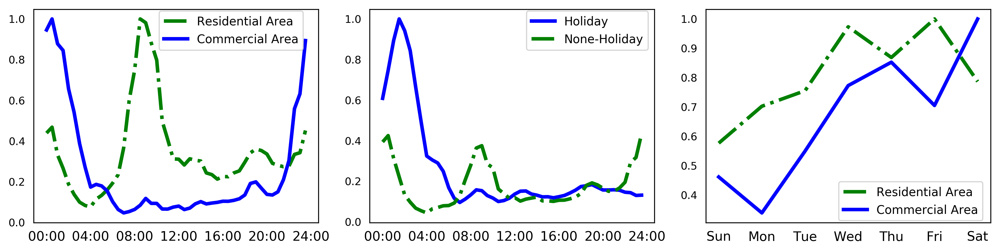
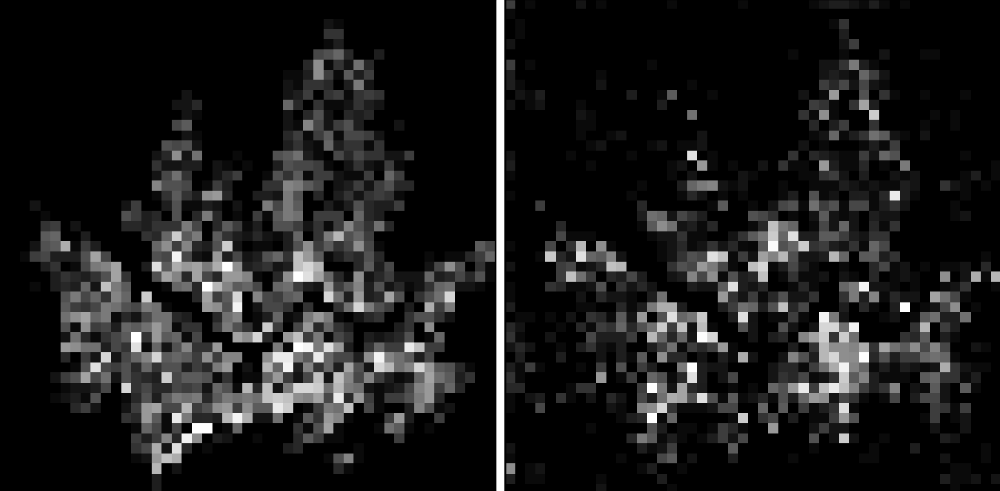
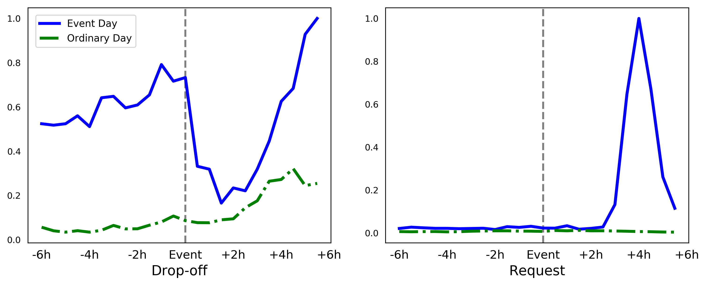

## Seoul City taxi request forecast

------------

<b>[ Intro ]</b>

- On-demand taxi request service is very convenient in city life.
- Taxi request data shows variety pattern depends on the time and location

<br>


```
Seoul Ride Hailing Requests:
(left) the ride hailing requests in residential and commercial area,
(middle) different patterns in residential area on holiday and
(right) average requests in each day of week
```

<br><br><br>

<b>[ Data Processing ]</b>

- To capture the Spatial / Temporal information in the same time
- We use Unet based the fully convolutional network
- To do this, we split the Seoul city to 50x50 grid (approx. 800m x 700m ) and the data aggregated in 30 mins.
- We used the Requests data on the spot and drop-off data on the spot.
- Two data type have different patterns, below shows the results.

<br>


```
Aggregated request data to grid cell, which has in 30 minutes.
(left) Requests data in 08/01/2018 Mon AM 08:00
(right) Drop-off data in same day and same time  
```

<br>

- We also apply the same model to NYC datasets : http://www.nyc.gov/html/tlc/html/about/trip_record_data.shtml
- Compare to previous work, NYC-Taxi open dataset, which contains taxi trip records of NYC in 2015, from 01/01/2015 to 03/01/2015, is used.
(Yao, H.; Tang, X.; Wei, H.; Zheng, G.; Yu, Y.; and Li, Z. 2018a. Modeling spatial-temporal dynamics for traffic pre- diction. arXiv preprint arXiv:1803.01254.)[[pdf]](https://arxiv.org/abs/1803.01254)

- The first 40 days data is considered training purpose, and the remaining 20 days are tested.

<br><br><br>
<b>[ Results ]</b>

- We achieve the performance enhancement previous works on the NYC datasets.

| Method | MAPE | RMSE |
|:--------|:--------:|:--------:|
| Historical AVG | 23.18% | 43.82 |
| ARIMA | 22.21% | 36.53 |
| LinUOTD | 19.91% | 28.48 |
| XGBoost | 19.35% | 26.07 |
| ConvLSTM | 20.50% | 28.13 |
| ST-ResNet | 21.13%| 26.23 |
| DMVST-Net | 17.36% | 25.71 |
| STDN | 16.30% | 24.10 |
| <b>TGNet</b> | <b>15.65%</b> | <b>24.08</b> |

- We also applied the same model to Seoul City datasets.

| Method | MAPE | RMSE |
|:--------|:--------:|:--------:|
| ARIMA | 23.05% | 12.53 |
| XGBoost | 19.68% | 8.08 |
| Baseline | 18.87% | 7.06 |
| Baseline + Drop-off | 18.62% | 6.73 |
| Baseline + Temporal Information | 17.97% | 6.68 |
| <b>TGNet</b> | <b>17.72</b> | <b>6.32</b> |


<br><br><br>
<b>[ Contribution ]</b>

- Our contribution is introduced temporal data directly to model output, then increase the performance.
- Another one is using drop-off data. In some locations, drop-off data may represent the future demand.
- We located those spot that held festival, concert and events irregularly.



```
- We select 4 Area which has stadium or complex hall
- That place held the event irregularly such as Concert, Festival, Convention
  - (1) Gocheok Skydome [37.498555, 126.867300]
  - (2) Jangchung Sports Complex [37.558160, 127.006782]
  - (3) Seoul worldcup stadium - (Sangam) [37.568130, 126.897210]
  - (4) Seoul olympic stadium - (Jamsil) [37.515686, 127.072793]
```
Full Event list to considered model [[link]](./event_list.md)

<br><br><br>
<b>[ Experiment ]</b>

- UNet based network (CNN kernel size 3x3)
- using skip-connection
- Average pooling
- ADAM optimization
- 20% validation set out of training, early stopping applied when the val_loss is not changed

<br><br><br>
