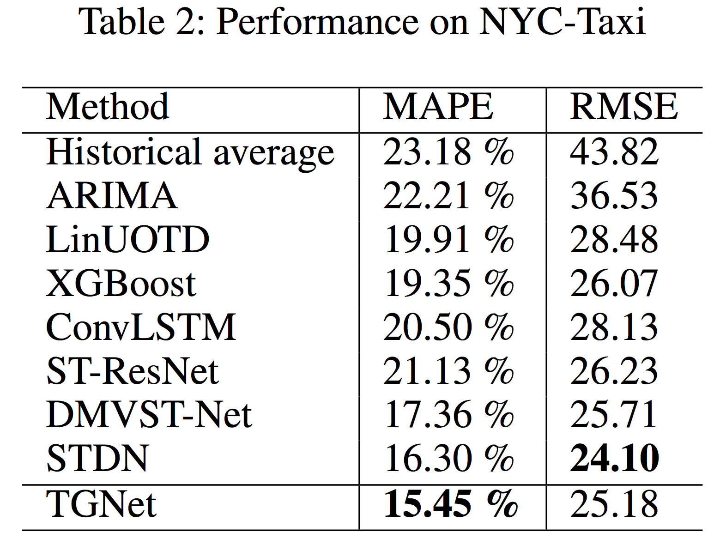

## Seoul City taxi request forecast

------------

<b>[ Intro ]</b>

- On-demand taxi request service is very convenient in city life.
- Taxi request data shows variety pattern depends on the time and location

<br>


```
Seoul Ride Hailing Requests: 
(left) the ride hailing requests in residential and commercial area, 
(middle) different patterns in residential area on holiday and 
(right) average requests in each day of week
```
<br>

<b>[ Data Processing ]</b>

- To capture the Spatial / Temporal information in the same time
- We use Unet based the fully convolutional network
- To do this, we split the Seoul city to 50x50 grid (approx. 800m x 700m ) and the data aggregated in 30 mins.
- We used the Requests data on the spot and drop-off data on the spot.
- Two data type have different patterns, below shows the results.

<br>


```
Aggregated request data to grid cell, which has in 30 minutes. 
(left) Requests data in 08/01/2018 Mon AM 08:00 
(right) Drop-off data in same day and same time  
```

<br>

- We also apply the same model to NYC datasets : http://www.nyc.gov/html/tlc/html/about/trip_record_data.shtml
- Compare to previous work, NYC-Taxi open dataset, which contains taxi trip records of NYC in 2015, from 01/01/2015 to 03/01/2015, is used.
(Yao, H.; Tang, X.; Wei, H.; Zheng, G.; Yu, Y.; and Li, Z. 2018a. Modeling spatial-temporal dynamics for traffic pre- diction. arXiv preprint arXiv:1803.01254.)[[pdf]](https://arxiv.org/abs/1803.01254)

- The first 40 days data is considered training purpose, and the remaining 20 days are tested.


<b>[ Results ]</b>

- We achieve the performance enhancement previous works on the NYC datasets.



